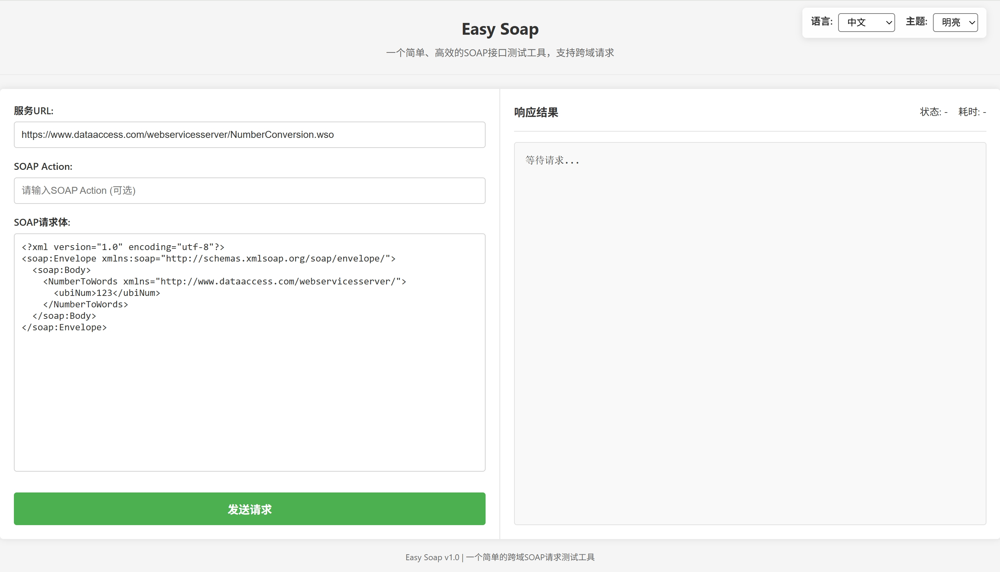
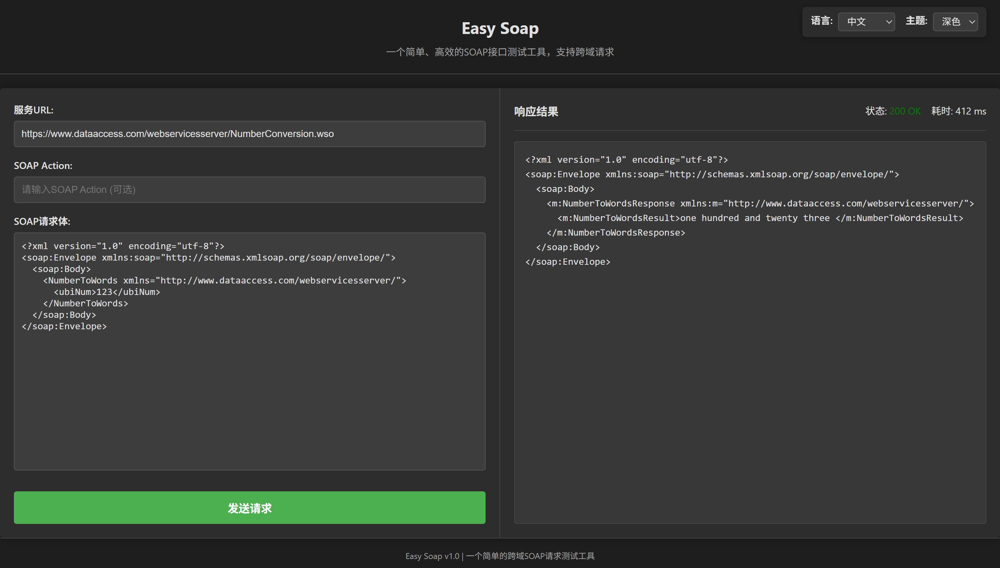
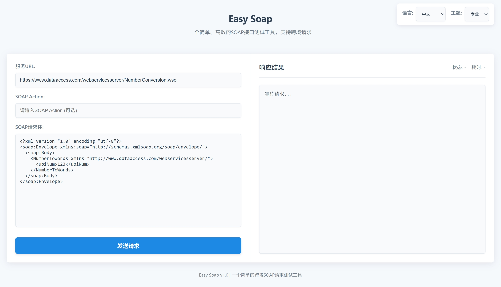

# Easy Soap (Chrome扩展)

这是一个简单的SOAP接口测试工具，作为Chrome浏览器扩展实现，可以绕过浏览器的同源策略限制，方便测试SOAP Web服务。使用全屏标签页界面，提供更好的使用体验。






## 特性

- 支持全屏标签页模式，提供更宽敞的工作空间
- 发送SOAP请求到任意URL（无跨域限制）
- 支持设置SOAPAction头
- 提供了基本的SOAP请求模板
- 显示响应状态、响应时间
- 自动格式化XML响应
- 保存上次使用的URL、Action和请求体

## 安装方法

### 从Chrome网上应用店安装
1. 访问Chrome网上应用店
2. 搜索"SOAP接口测试工具"
3. 点击"添加到Chrome"

### 手动安装开发版本
1. 下载并解压此扩展
2. 打开Chrome浏览器，输入 `chrome://extensions/`
3. 打开右上角的"开发者模式"
4. 点击"加载已解压的扩展程序"
5. 选择解压后的扩展目录

## 使用方法

1. 点击Chrome工具栏中的SOAP测试工具图标
2. 扩展会在新标签页中打开测试工具界面
3. 在左侧界面中输入SOAP服务的URL
4. 可选：输入SOAPAction
5. 修改SOAP请求体（XML）
6. 点击"发送请求"按钮
7. 在右侧面板查看响应结果

## 目录结构
```
.
├── manifest.json        # 扩展配置文件
├── index.html           # 标签页HTML
├── index.js             # 标签页脚本
├── lang.js              # 中英文国际化脚本
├── background.js        # 后台脚本，用于处理跨域请求
└── images/              # 图标目录
    ├── icon16.png       # 16x16图标
    ├── icon48.png       # 48x48图标
    └── icon128.png      # 128x128图标
```

## 为什么使用Chrome扩展？

浏览器通常会阻止网页直接发送跨域AJAX请求（同源策略）。通过实现为Chrome扩展，我们可以：

1. 绕过浏览器的同源策略限制，允许向任何网址发送SOAP请求
2. 提供更好的用户体验，包括全屏UI和保存历史记录
3. 提供更安全的环境，防止恶意代码攻击

## 示例SOAP请求

```xml
<?xml version="1.0" encoding="utf-8"?>
<soap:Envelope xmlns:soap="http://schemas.xmlsoap.org/soap/envelope/">
  <soap:Header>
    <!-- 可选的Header信息 -->
  </soap:Header>
  <soap:Body>
    <YourMethod xmlns="http://example.org/soap">
      <Param1>值1</Param1>
      <Param2>值2</Param2>
    </YourMethod>
  </soap:Body>
</soap:Envelope>
```

## 隐私说明

此扩展不会收集或传输任何数据到外部服务器。所有数据（包括URL和请求体）仅存储在本地，用于改善用户体验。 